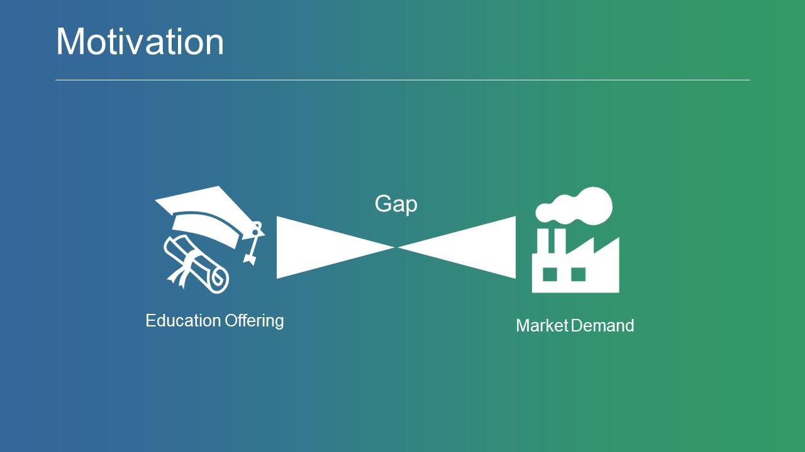
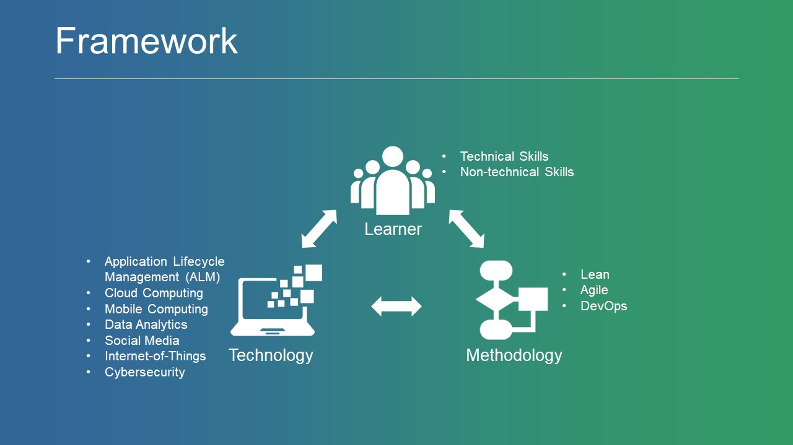
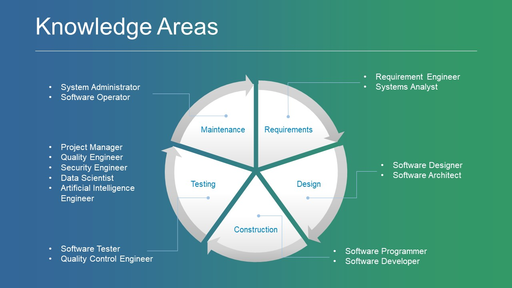
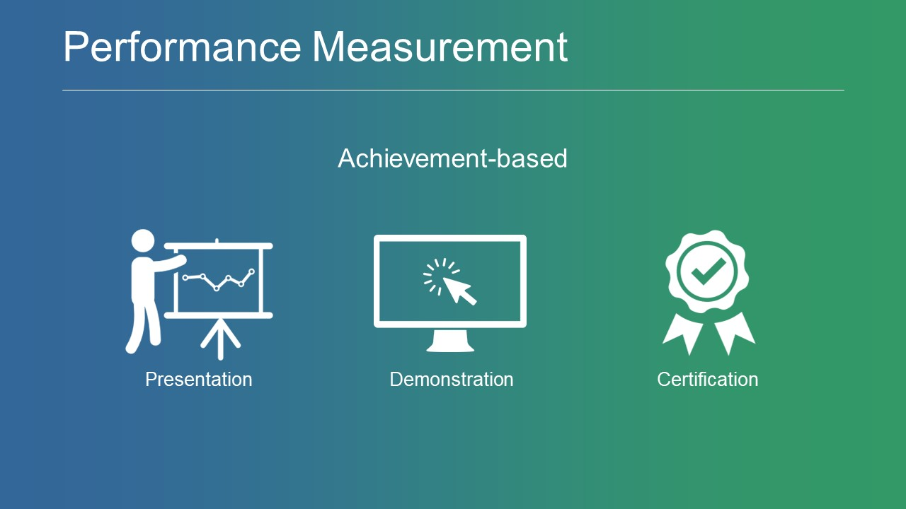

## Welcome to Software Engineering Guide

Software Engineering Guide (SEG) is a curated list of high-quality and free self-learining materials in software engineering domain. SEG is organized into specialized tracks (role-based) that cover the entire software development life cycle (SDLC) and represent the most popular working roles related to software engineering. Each track has a set of learning resources that are organized into four levels: foundation, basic, intermediate, and advanced. Each level has three categries of learing resources: MOOCs, webinars, and others.

### Motivation

The motivaiton behind buidling this guide is the noticible gap between the education offering -- specially in developing countries -- and the industry demand. However, nowadasy, with the availability and affordability of internet connection, you can esaily gain free of cost access to high-quality learning resources.

### Principles

To be a professional software engineer, you must guide yourself by adopting some important principles, including ambition, passion, focus, self-motivation, self-learning, and seriousness. Without such principles, it would be very difficult to be in mastry level of software engineering.

 

### Framework

The SEG is developed based on a framework that consists of three important components that form a professional software engineer: learner (aqcuiring technical and non-technical skills), methodology (adopting lean, agile, and DevOps), and technology (using next generation technologies, such as ALM, IoT, cloud computing, etc.).

 

### Knowledge Areas

The SEG is guided by the knowledge areas of the [SWEBOK V3] (https://www.computer.org/web/swebok/v3) which known as Software Development Life Cycle (SDLC). Moreover, we have tried to link the different software engineering related roles to those knowlege areas. Moreover, we have added more roles that are mostly related to the entire SCLC.

 

### Spcialized Tracks

The SEG includes nine different tracks (role-based) and provides a guidance and learning resources for each track. Click on any track to go to its guidance and learning resources:

1. [Software Requirements Engineer]()
2. [Software Designer]()
3. [Software Programmer]()
4. [Software Tester]()
5. [Software Administrator]()
6. [Software Quality Engineer]()
7. [Software Security Engineer]()
8. [Software Project Manager]()
9. [Software Data Scientist]()

### Learning Process

To get the full advantage of this guide, we highly recommend you to first select a role from the specialized tracks listed above. Then, begin the following process: learning, practicing, networking, and teaching.

 

- **Learning**: self-learning process to increase the learner's knowledge based on available online resources. The learner can leverage the collected resources available in this gudie for each specializec role. These collections contain up-to-date, high-quality, and free online learning resources. In addition, we will keep updating these collections with latest relevant content.

- **Practicing**: working on different tools and technologies to improve the learner's skills. The learner can utalize the open source tools and also can gain a trial/free acess to some commercial tools.

- **Networking**: joining and connecting to professional specialized online communities. This allows the learner to keep updated with latest trends and technologies in their specialized knowledge areas. Moreover, the learner can ask and communicate with experts in case he/she encounters any difficulty.

- **Teaching**: it is one of the most valuable learning technique. Once the learner knows that he/she has to teach others about what he/she has learned, this definitely makes him/her more serious in his/her learning process. Additionally, through this process, the learner can practice and gain non-technical (soft) skills like confidence, communication, presentation, speaking, etc.

### Learning Outcomes

| Level        | Description           | Outcome  |
| ------------- |:-------------| :-----|
| **Foundation**     | Explains how to learn and provides an overall background about software engineering as well as a guidance to your selected career path | Understanding of the importance of self-learning, and having an idea about software engineering in general and the selected career path |
| **Basic**     | Focuses on the basic knowledge and skills of a particular specialization (track)     |   Understanding of the fundamentals of the selected learning path |
| **Intermediate** | Focuses on agile approaches and application life-cycle management (ALM) tools      |    The ability to develop prototypes (partially functioning software) using an agile approach and ALM tools |
| **Advanced** | Focuses on next generation technologies (e.g. internet-of-things and cloud computing) and DevOps      |    The ability to develop next-generation real applications (fully functioning software) using cloud computing and DevOps approach |

### Performance Measurement

It is very important for any software engineer to meausre his/her progress towards his/her learning objectives. From practical perspective, this can be achived by different means such as delievring a technical presentation, demonstrating a peice of a developed prototype or a full functioning application, or acquiring a professional certification in his/her domain.

 

### Aditional Resources

- [Soft Skills]()
- [Entrepreneurship Skills]()

### Contact

  

