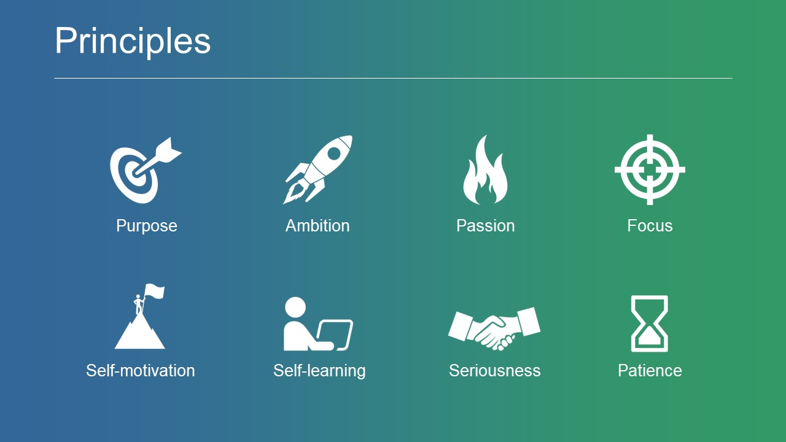

## Welcome to Software Engineering Guide

> *How can I be a professional software engineer without a formal education? Here, SEG to help you!*

Software Engineering Guide (SEG) is a self-learning roadmap with a curated list of high-quality and free-of-cost learning resources in software engineering domain. SEG is a role-based guide that is organized into specialized tracks (career paths). SEG covers the entire software development lifecycle (SDLC) knowledge domains that represent the most popular working roles related to software engineering. Each track has a set of online learning resources that are organized into four levels: foundation, basic, intermediate, and advanced. Each level has a variety of online learning resources that are categorized into three types: MOOCs, webinars, and others. These learning resources are collected from highly-respected and well-trusted sources.

### Motivation

The motivation behind building this guide is the existing gap between the knowledge and skills that are acquired from the traditional education offering and the ones that are demanded by the industry--especially at the places with low-quality education. However, nowadays, with the availability and affordability of internet connection, you can easily gain a free-of-cost access to high-quality learning resources from around the world. *Therefore, there is no excuse to say that I don't have a quality education!*

### Principles

To be a professional software engineer, you have to guide yourself by adopting some important principles, including ambition, passion, focus, self-motivation, self-learning, and seriousness. Without such principles, it would be very difficult to be in a mastery level of software engineering.

 

### Framework

The SEG is inspired by a framework that combines three essential components to develop a professional software engineer, including learner (acquiring technical and non-technical skills), methodology (adopting lean, agile, and DevOps), and technology (using next-generation technologies, such as ALM, IoT, cloud computing, etc.).

 

### Knowledge Areas

The SEG is developed based on the main knowledge areas of software engineering (SDLC) included in the [SWEBOK V3](https://www.computer.org/web/swebok/v3). Moreover, we have tried to map those knowledge areas to the most popular software engineering related roles available in the industry.

 

### Specialized Tracks

The SEG includes nine different role-based tracks (specializations) and provides useful information and learning resources for each track. Each track is associated with a LinkedIn group to facilitate the knowledge sharing and professional networking.

1. [Software Requirements Engineer](swr.md) 
2. [Software Designer](swd.md) 
3. [Software Programmer](swc.md) 
4. [Software Tester](swt.md) 
5. [Software Administrator](swm.md) 
6. [Software Quality Engineer](swq.md) 
7. [Software Security Engineer](sws.md) 
8. [Software Project Manager](swem.md) 
9. [Software Data Scientist](swds.md) 

### Learning Process

To get a full advantage of this guide, we highly recommend you to first select a role from the specialized tracks listed above. Then, begin the following process: learning, practicing, networking, and teaching. This process is overlapped, iterative, and should be a life-long journey for developing knowledge and skills in any domain.

 

- **Learning**: a self-learning process to increase the learner's knowledge based on available online resources. The learner can leverage the collected resources available in this guide for each specialized role. These collections contain up-to-date, high-quality, and free-of-cost online learning resources. In addition, we will keep updating these collections with latest relevant content.

- **Practicing**: using software tools and technologies to improve the learner's skills. The learner can utilize open source software tools and also can gain a trial/free access to some commercial software tools to apply the acquired knowledge.

- **Networking**: joining and connecting with professional specialized online communities. This allows the learner to keep updated with latest trends and technologies in his/her specialized knowledge areas. Moreover, the learner can ask and communicate with experts in case he/she has an inquiry or encounters any difficulty.

- **Teaching**: to help in getting serious, sharing knowledge, and improving soft skills. Once the learner knows that he/she has to teach others about what he/she has learned, this definitely makes him/her more serious in his/her learning process. Additionally, through this process, the learner can practice and gain non-technical (soft) skills like confidence, communication, presentation, speaking, etc.

### Learning Outcomes

| Level        | Description           | Outcome  |
| ------------- |:-------------| :-----|
| **Foundation**     | Explains how to learn and provides an overall background about software engineering | Understanding of the importance of self-learning and having an idea about software engineering, in general |
| **Basic**     | Focuses on the basic knowledge and skills of a particular specialization (track) |   Understanding of the fundamentals of the selected learning track |
| **Intermediate** | Focuses on agile approaches and application life-cycle management (ALM) software | The ability to develop prototypes (partially functioning software) using an agile approach and ALM software |
| **Advanced** | Focuses on next-generation technologies (e.g. internet-of-things and cloud computing) and DevOps      |    The ability to develop next-generation applications (fully functioning software) using cloud computing and DevOps approach |

### Performance Measurement

It is very important for any software engineer to measure his/her progress towards his/her learning objectives and career path. From a practical perspective, this can be achieved by different means such as delivering a technical presentation, demonstrating a piece of a developed prototype or a fully functioning application, or acquiring a professional certification in his/her domain.

 

### Additional Resources

- [Soft Skills](ss.md)
- [Entrepreneurship Skills](es.md)

### Contact

 

