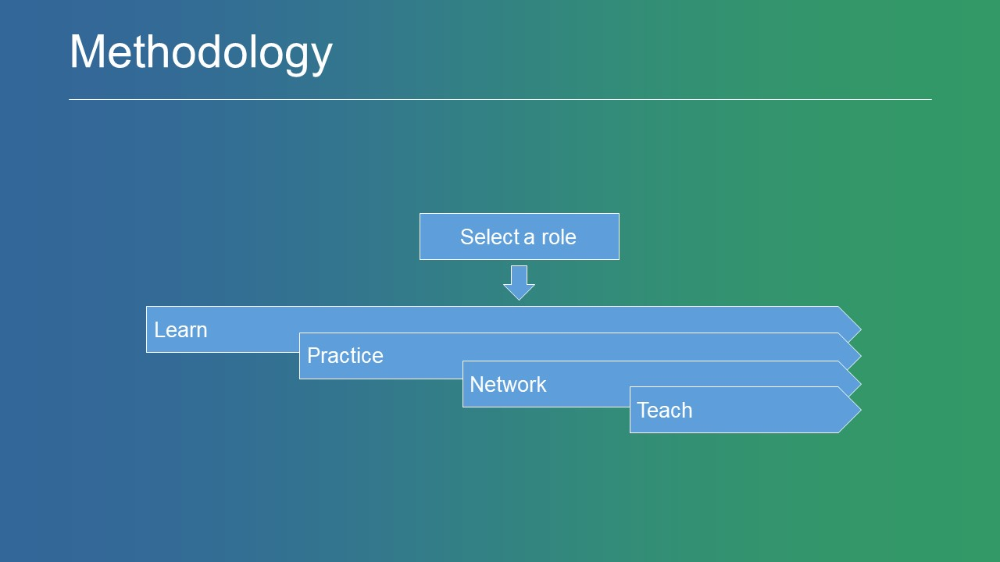

## Welcome to Software Engineering Guide

Software Engineering Guide (SEG) is a curated list of high-quality and free self-learning materials in software engineering domain. SEG is organized into specialized tracks (role-based) that cover the entire software development life cycle (SDLC) and represent the most popular working roles related to software engineering. Each track has a set of online learning resources that are organized into four levels: foundation, basic, intermediate, and advanced. Each level has three categories of leering resources: MOOCs, webinars, and others.

### Motivation

The motivation behind building this guide is the noticeable gap between the knowledge and skills that are acquired from the traditional education offering and the ones that are demanded by the industry today-- especially in developing countries. However, nowadays, with the availability and affordability of internet connection, you can easily gain free of cost access to high-quality learning resources from around the world. Therefore, there is no excuse to say that I don't have a quality education!

### Principles

To be a professional software engineer, you must guide yourself by adopting some important principles, including ambition, passion, focus, self-motivation, self-learning, and seriousness. Without such principles, it would be very difficult to be in mastery level of software engineering.

 

### Framework

The SEG is inspired by a framework that consists of three important components to develop a professional software engineer: learner (acquiring technical and non-technical skills), methodology (adopting lean, agile, and DevOps), and technology (using next generation technologies, such as ALM, IoT, cloud computing, etc.).

 

### Knowledge Areas

The SEG is developed based on the main knowledge areas of the [SWEBOK V3] (https://www.computer.org/web/swebok/v3), which known as Software Development Life Cycle (SDLC). Moreover, we have tried to map those knowledge areas to the most popular software engineering related roles available in the industry.

 

### Specialized Tracks

The SEG includes nine different role-based tracks (specialization) and provides useful information and learning resources for each track. Click on anyone of the following tracks to go to its information and learning resources:

1. [Software Requirements Engineer]()
2. [Software Designer]()
3. [Software Programmer]()
4. [Software Tester]()
5. [Software Administrator]()
6. [Software Quality Engineer]()
7. [Software Security Engineer]()
8. [Software Project Manager]()
9. [Software Data Scientist]()

### Learning Process

To get the full advantage of this guide, we highly recommend you to first select a role from the specialized tracks listed above. Then, begin the following process: learning, practicing, networking, and teaching. This process should be a life-long journey for developing knowledge and skills in any domain.

 

- **Learning**: self-learning process to increase the learner's knowledge based on available online resources. The learner can leverage the collected resources available in this guide for each specialized role. These collections contain up-to-date, high-quality, and free-of-cost online learning resources. In addition, we will keep updating these collections with latest relevant content.

- **Practicing**: working on and using different tools and technologies to improve the learner's skills. The learner can utilize open source tools and also can gain a trial/free access to some commercial tools to apply the acquired knowledge.

- **Networking**: joining and connecting to professional specialized online communities. This allows the learner to keep updated with latest trends and technologies in their specialized knowledge areas. Moreover, the learner can ask and communicate with experts in case he/she encounters any difficulty.

- **Teaching**: getting serious, sharing knowledge, and improving soft skills. Once the learner knows that he/she has to teach others about what he/she has learned, this definitely makes him/her more serious in his/her learning process. Additionally, through this process, the learner can practice and gain non-technical (soft) skills like confidence, communication, presentation, speaking, etc.

### Learning Outcomes

| Level        | Description           | Outcome  |
| ------------- |:-------------| :-----|
| **Foundation**     | Explains how to learn and provides an overall background about software engineering as well as a guidance to the selected career path (track) | Understanding of the importance of self-learning, having an idea about software engineering, in general, and how to become a professional in the selected role (career path) |
| **Basic**     | Focuses on the basic knowledge and skills of a particular specialization (track)     |   Understanding of the fundamentals of the selected learning track |
| **Intermediate** | Focuses on agile approaches and application life-cycle management (ALM) software      |    The ability to develop prototypes (partially functioning software) using an agile approach and ALM software |
| **Advanced** | Focuses on next generation technologies (e.g. internet-of-things and cloud computing) and DevOps      |    The ability to develop next-generation applications (fully functioning software) using cloud computing and DevOps approach |

### Performance Measurement

It is very important for any software engineer to measure his/her progress towards his/her learning objectives and career path. From practical perspective, this can be achieved by different means such as delivering a technical presentation, demonstrating a piece of a developed prototype or a full functioning application, or acquiring a professional certification in his/her domain.

 

### Additional Resources

- [Soft Skills]()
- [Entrepreneurship Skills]()

### Contact

 

